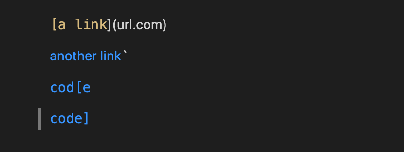
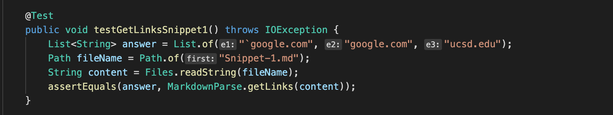
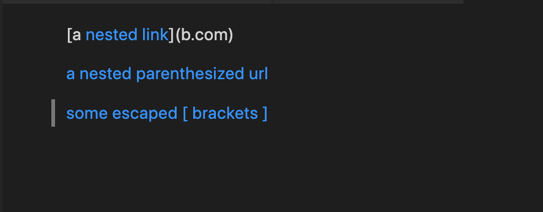
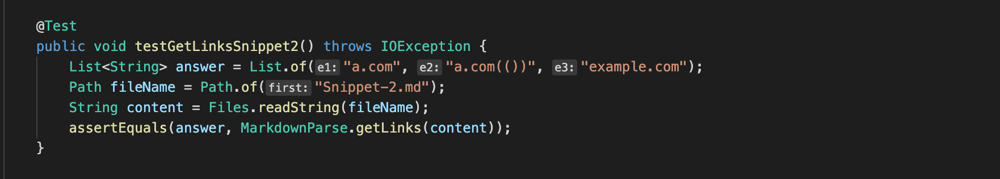
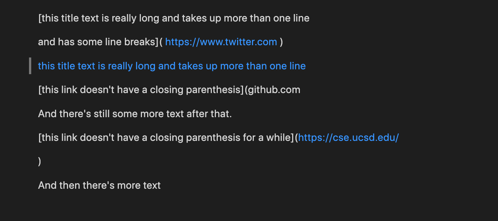
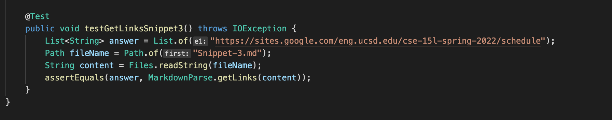
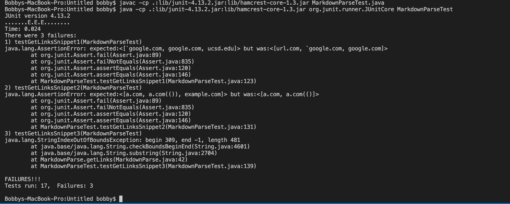
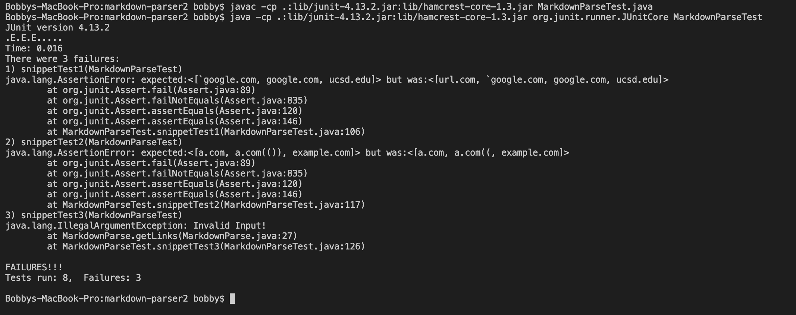

**Lab Report 4**

[Link to HomePage](https://bobbyyuuuu.github.io/Caramel/index.html)

---
[Link to my MarkdownParse repository](https://github.com/BobbyYuuuu/markdown-parser)

[Link to the repository I reviewed](https://github.com/httrieu/markdown-parser)

---
- Snippet 1

Here are the output that are given by VScode for Snippet 1, that means in this case, the expected output for Snippet one should be: [`google.com, google.com, ucsd.edu].

With this information, we can create our test case for Snippet 1, which is shown below.

- Snippet 2

Here are the output that are given by VScode for Snippet 2, that means in this case, the expected output for Snippet one should be: [a.com, a.com(()), example.com].

With this information, we can create our test case for Snippet 2, which is shown below.

- Snippet 3

Here are the output that are given by VScode for Snippet 3, that means in this case, the expected output for Snippet one should be: [https://sites.google.com/eng.ucsd.edu/cse-15l-spring-2022/schedule].

With this information, we can create our test case for Snippet 3, which is shown below.

After creating all the test cases needed, we can run these test in the two repositories.

Here are the results for running the tests in my own repository

And here are the results for running the tests in the repository that I reviewed.

As we can see here on the two results, all three tests failed for both of the repositories, for Snippet 1 and 2, both repositories ended up with different outputs, but neither of the repositories was able to print out the expected output, and both of the repositories had different output for both testcase for Snippet 1 and 2. However, as shown above, both repositories even failed to print anything for Snippet 3's test. My repository said that index is out of range for Snippet 3, and the repository that I reviewed shows that Snippet 3 markdown file is an invalid input.

Snippet 1 solution: My idea for solving the issues that we have with Snippet 1 is that we need to write a code that detects whether the inline code is in the bracket or not. So if both inline code symbol is in contained in the open and close bracket, then it is a working website, if only one side of the symbol is contained in the open and close bracket, then it is not a working site format. I believe that this change can be done within two or three lines because it only need some if statements.

Snippet 2 solution: I think that we might need more than 10 lines to solve this problem because we have to go through everything that is in the input in order to detect the correct output. My team was able to solve a similar problem which only contains one extra parentheses, and that took us a few lines. So I believe if we have to solve for all nested cases, it will take more than 10 lines.

Snippet 3 solution: I believe that it is possible to resolve this issues within 10 lines because I think that this is something that is similar to the Snippet 1 issue. So I think we would just need an if statement to detect the spaces between each brackets and parenthese, and I believe that will resolve the problem.
