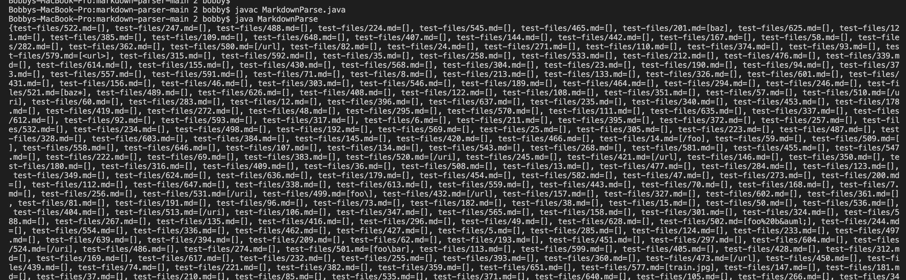

**Lab Report 5**

[Link to HomePage](https://bobbyyuuuu.github.io/Caramel/index.html)

---

In order to do the following lab report, I manually edited my code so that it prints out all the links for the two different implementation of MarkdownParse.java

As we can see, the two implementation has different outputs for test-files/488.md and test-files/201.md
