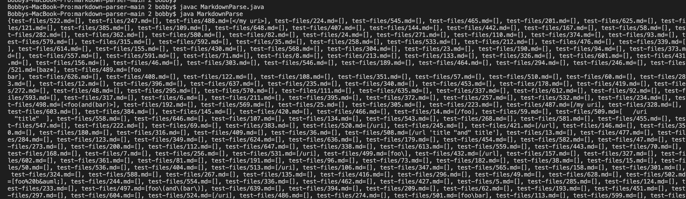
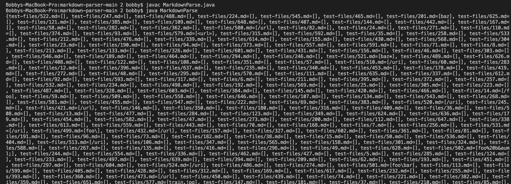
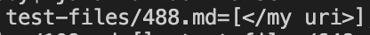
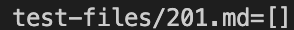
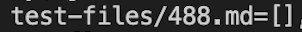
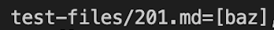
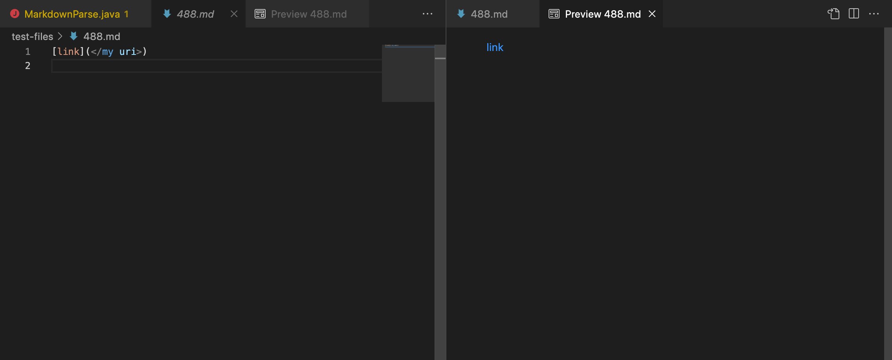
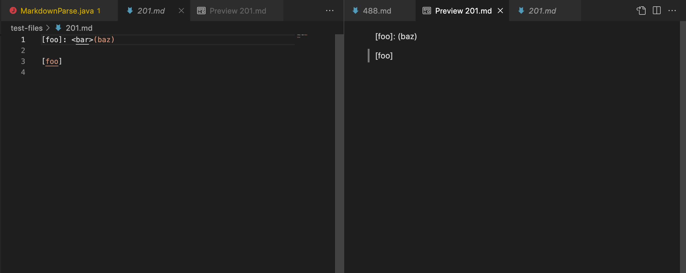
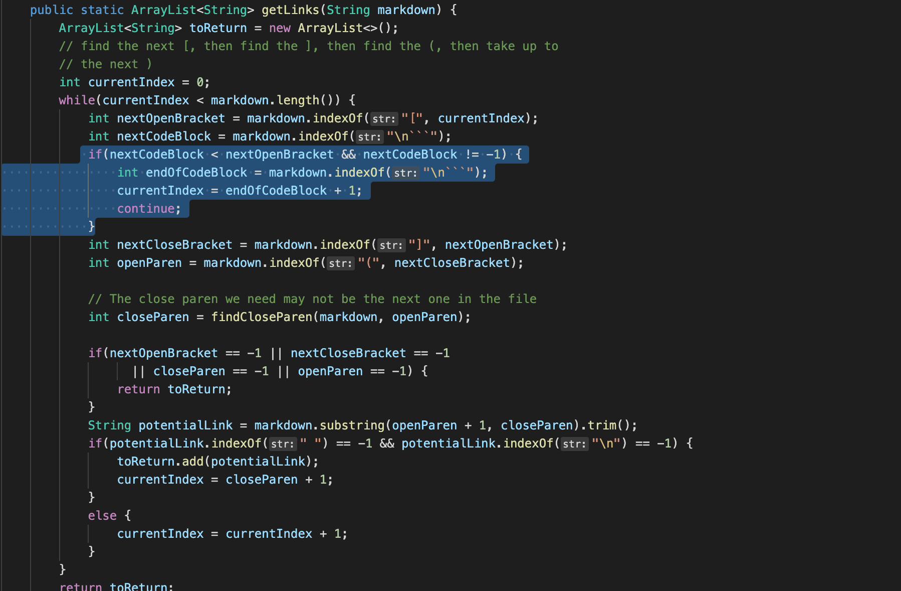

**Lab Report 5**

[Link to HomePage](https://bobbyyuuuu.github.io/Caramel/index.html)

---

In order to do the following lab report, I manually edited my code so that it prints out all the links for the two different implementation of MarkdownParse.java

My implementation

Lab 9 implementation

As we can see, the two implementation has different outputs for test-files/488.md and test-files/201.md, here are the two output in a closer look

My implementation:

Lab 9 implementation

Here are the links to the two test files:

[488.md](https://github.com/nidhidhamnani/markdown-parser/blob/main/test-files/488.md)

[201.md](https://github.com/nidhidhamnani/markdown-parser/blob/main/test-files/201.md)

And here is the actual/expected output for the two test-file that I aquired from VScode preview

Test-file/488.md:

Test-file/201.md:

With the preview, we can see that my implementation of the MarkdownParse is able to print both of the test case out correctly, and the Lab9 version of the MarkdownParse is not printing out the expected output.

As we can see in the preview for 288.md, the lab9 version of the MarkdownParse is still printing what is in the parentheses while there is something between the close bracket and the open parenthese. What is causing that error is because the lab9 version of the MarkdownParse does not have a code that detects if the next character after the closebracket is a openparentheses, in other words, it will still print out what is inside the parentheses when it is not suppose to. In order to fix this bug, we just need to add a line that checks if the next character after the closebracket is a openparenthese or not in the highlighted area.

