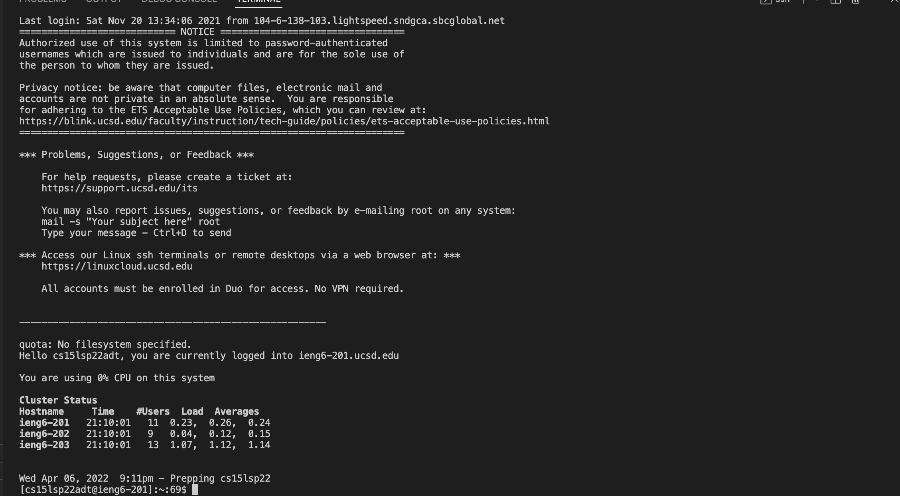
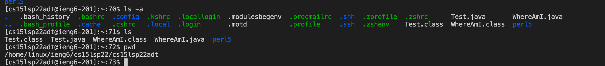
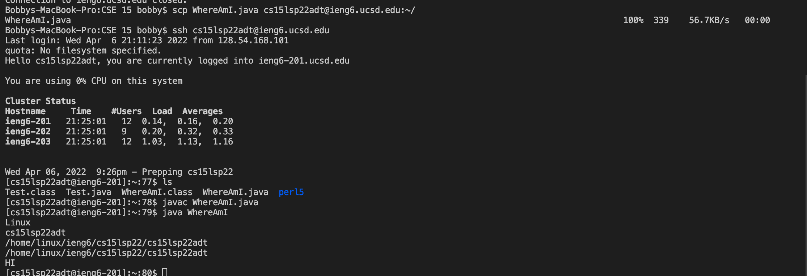
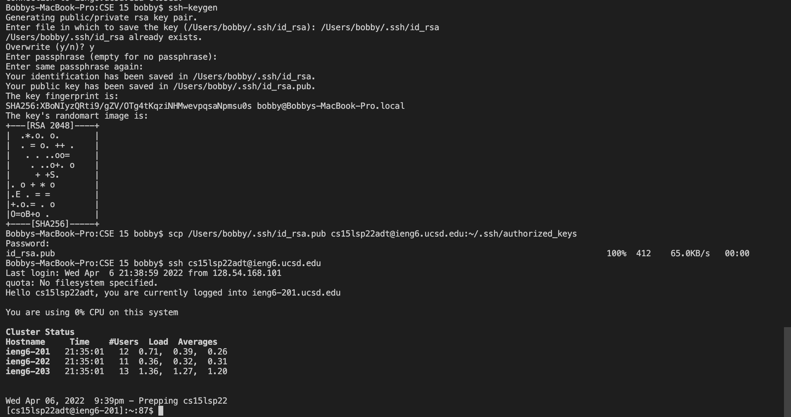
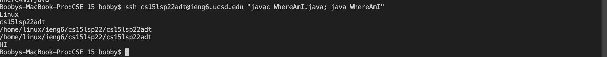

**Introduction to log into ieng6 account**

[Link to HomePage](https://bobbyyuuuu.github.io/Caramel/index.html)

1. First you will need to download VScode, goto the VScode website and download it. After downloading VScode, you will also need to download the java packages.
   After downloading you should see the current screen.

2. What you need to do next is to install SSH, after installing SSH, you will need to connect to the remote server. So you will need to type 
   "$ ssh cs15lsp22zz@ieng6.ucsd.edu" with the zz replaced with your own username. After this you will need to allow connect and enter your password, after that
   you will see the following screen on your terminal.

3. After you connected to the online server, you can trying to run some command. First you can try commands such as ls-a, ls, pwd.

4. Next step is we can try to copy files from our own computer into the server. We will complete this step with the scp command. Lets try 
   scp WhereAmI.java cs15lsp22zz@ieng6.ucsd.edu:~/ (With zz replaced with your username).

5. Our next step is to create a SSH key, this will allow us to log in to the server without typing our password over and over again. First we start with the ssh-keygen
   command. After that  we will need to follow the instructtions, make sure to leave the password empty when you create your key. After that we will need to exit the server and we will store our key.

6. Finally we can try to run some command within one line, this is save our time when we try to run certain commands. For example we can log on to the server and complie the files at the same time.

