**Lab Report 3**

[Link to HomePage](https://bobbyyuuuu.github.io/Caramel/index.html)

## Streamlining ssh Configuration ##

 - First step, navagate to your ssh./config file, then insert your log in information into the file.
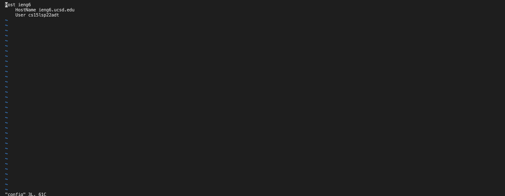

- Save the file, then you should be able to log in with your alias.
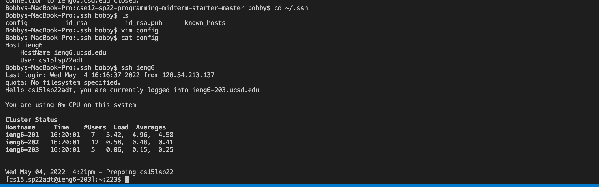

- You are also able to use your alias to make copies to the server!
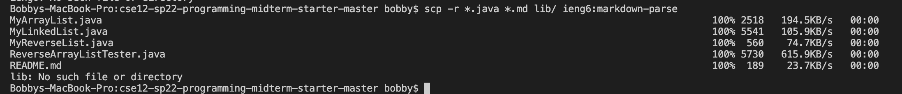

## Setup Github Access from ieng6 ##

- After storing your public key in github, you should see the following in your page.
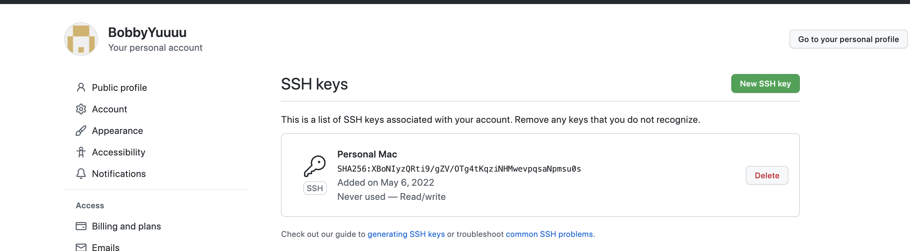

- In your own computer, you should see the file containing the private key.
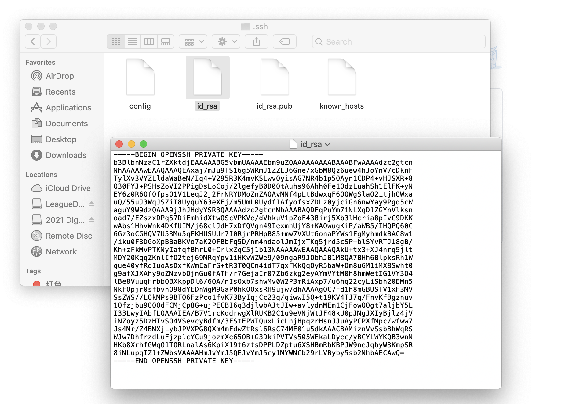

- You can also perform git commands such as commit, add, and push in your terminal.
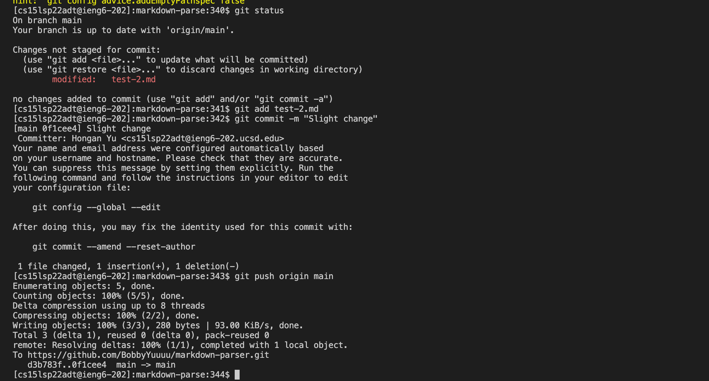

[Link to commit](https://github.com/BobbyYuuuu/markdown-parser/commit/0f1cee449caf0cdedff2368e44f734ad407dd40b)
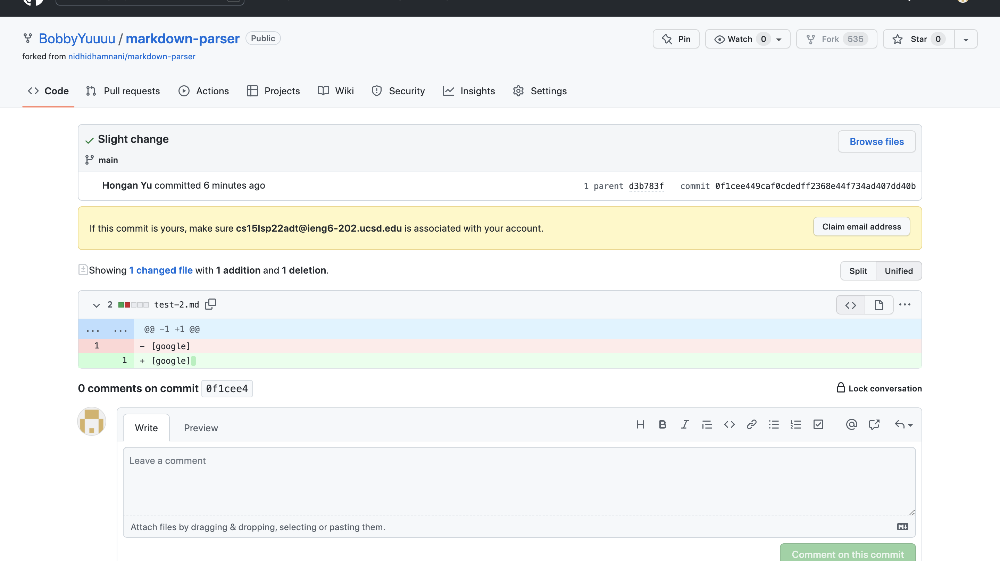

## Copy whole directories with scp -r ##

- Instead of performing scp on a certain file, if you do -r, it will make a copy of everything in the directory. 
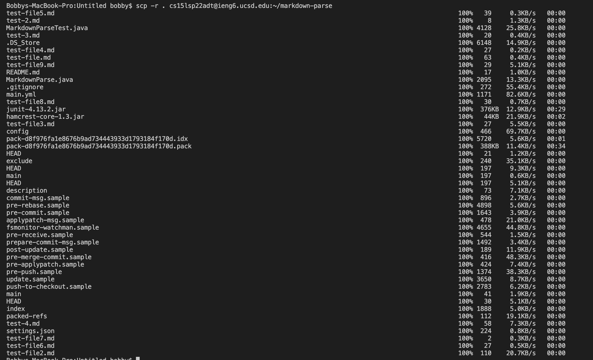

- After this step, you should be able to compile and run your tests on your ieng6 account.
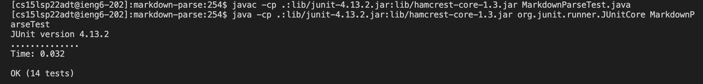

- Moreover, you can make a copy and ssh, and compiling and running your file in the same command!
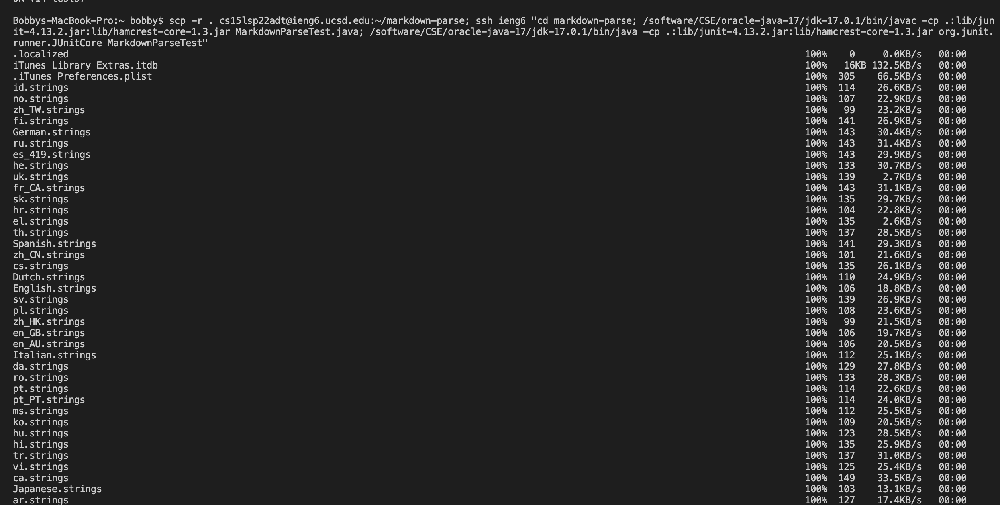
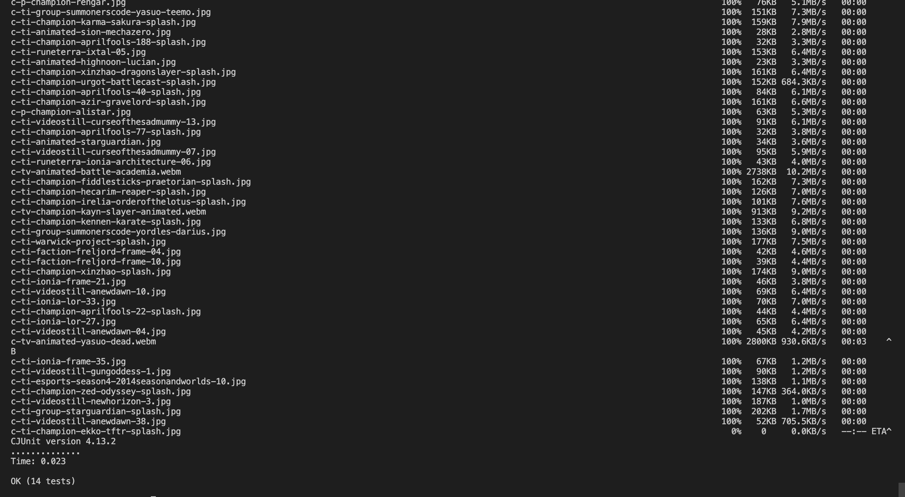
