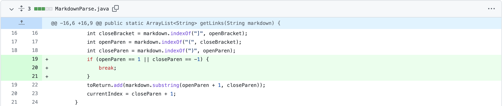
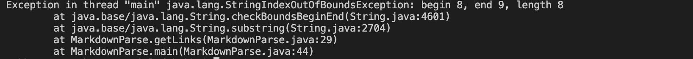
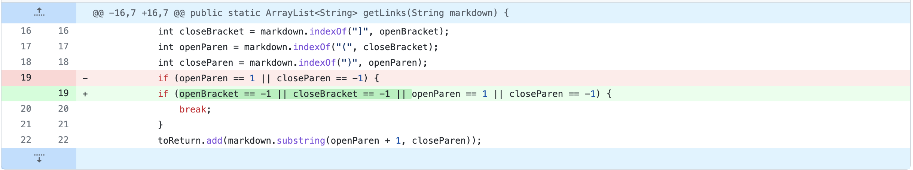

**Lab report 2**

[Link to HomePage](https://bobbyyuuuu.github.io/Caramel/index.html)

## Code change 1

[Link to test file that caused error](https://github.com/BobbyYuuuu/markdown-parser/blob/main/test-2.md)

For this case, it was not suppose to print anything because they are missing a open and close parenthesis, the input was just [google] instead 
of [google.com] (google.com). So it is causing an index out of bounds because it is missing a open and close bracket, so we added codes to ensure that the code will not cause an IndexOutofBounds exception.

## Code change 2

[Link to test file that caused error](https://github.com/BobbyYuuuu/markdown-parser/blob/main/test-.md)

For this case, it was not suppose to print anything because they are missing a open and close brackets, the input was just (google) instead 
of [google.com] (google.com). The problem with this input is that because it is missing a bracket, which is not in a website format, but the method
would still print out what is in the parenthesis because it does not know that it is not suppose to. So we ensured that a bracket has to be present in order for the method to print out the input.

